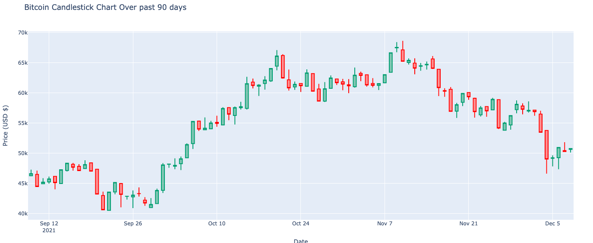

# Bitcoin
This script shows you the last 90 days' bitcoin prices. I used the the "CoinGecko" data market APIs in this project. 
```bash
$ pip install -r requirement.txt
$ python btc_viewer.py
```

# Screen Shot 

